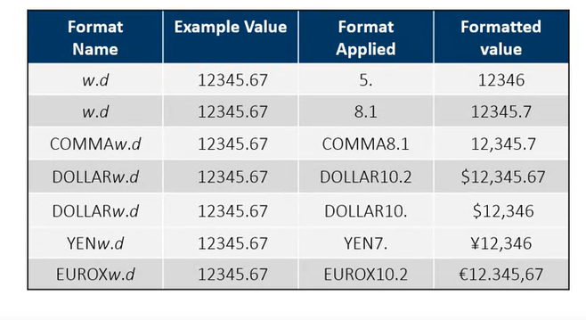

SAS Course part 1 out of 4
================
Douwe Horsthuis
2022-12-28

# SAS steps

A SAS script is created by coding several “steps”. SAS has 2 types of
steps data steps or procedure steps. You can recognize what a step is
about by looking at the first word of the code snipped. It either starts
with DATA or PROC, but there are are also global statements that can
happen outside of these steps.  
Steps either end with a run statement, most of the time, or a quit
statement (some of the time).

## Data step

Data steps usually read data from an input source, processes it and
creates a SAS table. It might also filter rows, create new columns or
join tables or do other data manipulation.

## Procedure (Proc) step

A proc step processes a SAS table in a specific and predefined way. This
can be outputting a certain graph or doing statistics.

## Global statements

These statements are things like “Title, Options, Libname etc. They
exist outside of the steps, and do not need a run statement after them.

# Exporting data

You can export data using a `proc export` statement. The full step would
be:

``` sas
PROC EXPORT DATA=input-table OUTFILE="output-file" <DBMS=identifier><REPLACE>;  
RUN;
```

the identifier field contains what type of file you like to create, CSV,
TAB, DLM, XLSX,…, and include a file path to where it should store it.
Which is easier with a macro variable. Once you have a macro variable
you can just add `outfile="&macrovariable-name/filename.filetype"`.

If you export to excel you can use add to your `ods` statement
`options(sheet_name='name you want')` if you want to change specific
sheet names.

# Simple Syntax error solving steps

When certain key words (such as DATA or var) are typed, SAS
automatically changes their color and sometimes makes them bold. If this
does not happen there is likely to be an error directly before it. If
you run code you should always first check the Log from top to bottom,
if there are errors, these will be noted there. It will tell you what
SAS thought was wrong and how it handled it.

# Column lengths

Oddly enough, the column length will dictate how long the variable can
be. So you have to predefined how many characters can be used. For
example, if the length is 2, “East Coast” will become “EA”.

# Missing values

Missing numerical values are represented as a period. They are treated
as the smallest possible number. Missing character values are a
represented as a \*.

# Libraries

When loading data, you can hardcore a file path to your data. Or you can
use a Library to make this quicker and easier to change. You do this by
using `LIBNAME libref enging "path";` This will create a way for SAS to
find your data.

# Working with excel data

When loading data that has column names that wouldn’t work for SAS. You
can use `OPTONS VALIDVARNAME=V7;` to make them valid. Things like spaces
or special characters become underscores and every column name is
shortened if needed to be shorter than 32 chars.  
Another important thing is to clear your library reference at the end of
your program. This will otherwise create a lock for other people.
`LIBNAME libref CLEAR;` Using `Sheet=Sheet_name` will allow you to load
anything else than the first excel sheet.

# Importing unstructured data

To import unstructured data, without a wizard, you can use

``` sas
PROC IMPORT DATAFILE="path/filename" DBMS=filetype
  OUT=output-table-name;
RUN;
```

SAS will use the first 20 rows to figure out the column attributes etc.
You can change this by using `GUESSINGROWS=n|MAX;` Either set N to how
much you want it to be or use MAX for all rows.

``` sas
*Complete the PROC IMPORT step;
PROC import datafile="filpath/filename.csv" dbms=CSV
    out=storm_damage_import replace;
Run;
  
*Complte the PROC OCNTENTS step;
PROC contents data=storm_damage_import;
run;
```

# Procudures

Print: creates a listing of all rows and columns of the data.  
Means: simple summary statistics (N Mean Std dev Min Max).  
Univariate: more detailed summary statistics.  
Freq: creates a frequency table for each column in the input table

# WHERE statement

Works like this:

``` sas
Proc procudure-name;
  WHERE expression;
RUN;
```

For dates you follow the “SAS date constant”. For example:
*“ddmmmmyyyy”d;*

## Missing values and WHERE statements

IF you do a WHERE statement where you say that a variable needs to be
smaller then x. Make sure to include 0\< before, or all the missing
values will be included. Example: `0<MinPressure<920`

If you are specifically looking for missing values you can use
`where Type=. or Type=" ";` Or you can use the special option of “is
missing”, “is NOT MISSING” or “is NULL”;  
`WHERE col-name IS MISSING;`  
`WHERE col-name IS NOT MISSING;` `WHERE col-name IS NULL;`  
`WHERE AGE IS MISSING;`  
`WHERE col-name IS null;`

## Wildcards for WHERE statements

% is a wildcard for any number of characters.  
\_ is a wildcard for a single character

for <a href="%5Bexample:%5D(example:)%7B.uri%7D"
class="uri">[example:\\](example:){.uri}</a>
`Where city like "New%"; Give new york new delly etc.`Where city like
“sant\_ %”\`  
Gives you for example Santa Clara or Santo Domingo

# Format statements

## Decimals

You can use format statements to edit the included data. For example
using: `format Height 4.1 Weight 3.;` Gives your for height 1 decimal
number and whole numbers for Weight.

## Date

You can turn sas (a number that starts at jan-1-1960) dates into a
positive or negative number. This can be formatted using:

<table style="width:90%;">
<colgroup>
<col style="width: 18%" />
<col style="width: 18%" />
<col style="width: 18%" />
<col style="width: 18%" />
<col style="width: 18%" />
</colgroup>
<thead>
<tr class="header">
<th><strong>To do this ...</strong></th>
<th><strong>Use this ...</strong></th>
<th><strong>List</strong></th>
<th><strong>Input</strong></th>
<th><strong>Result</strong></th>
</tr>
</thead>
<tbody>
<tr class="odd">
<td>Write SAS date values in re cognizable forms</td>
<td>Date formats</td>
<td>DATE<strong>w.</strong></td>
<td>14686</td>
<td>17MAR00</td>
</tr>
<tr class="even">
<td><br />
</td>
<td><br />
</td>
<td>DATE9.</td>
<td>14686</td>
<td><p>17MAR2000a</p>
<p><br />
</p></td>
</tr>
<tr class="odd">
<td><br />
</td>
<td><br />
</td>
<td>DAY<strong>w.</strong></td>
<td>14686</td>
<td>17</td>
</tr>
<tr class="even">
<td><br />
</td>
<td><br />
</td>
<td>DD MMYY<strong>w.</strong></td>
<td>14686</td>
<td>17/03/00</td>
</tr>
<tr class="odd">
<td><br />
</td>
<td><br />
</td>
<td>DDMMYY10.</td>
<td>14686</td>
<td>17/03/2000</td>
</tr>
</tbody>
</table>

For all options [see this
website](https://v8doc.sas.com/sashtml/lrcon/zenid-63.html)

# combining statement

You can combine multiple statements using `and` or `or`.
`WHERE Type="SUV" or Type="truck" or Type="wagon;`

However, it’s better to use `in`;  
`Where col-name IN (value1<...,value-n>);`  
`Where col-name NOT IN (value1<...,value-n>);`  
`Where Type IN ("SUV", "Truck", "Wagon");`

# Macro variables

Macro variable are variables you can create that allow you to group
names, so you only have to change it in one place. For example if you
want to change the `Type="Wagon"` to `Type="SUV"`:

``` sas
proc print data=sashelp.cars;
  where Type="Wagon";
  var Type make Model MSRP;
Run;
proc means data=sashelp.cars;
  where Type="Wagon";
  var MSRP MPG_Highway;
Run;
proc freq data=sashelp.cars;
  where Type="Wagon";
  tables Origin Make;
Run;
```

You would have to change 3 things. If you instead start with
`%let VaribleName=Columnname` you would only have to change the
Columname (Wagon) to SUV.

``` sas
%let CarType=Wagon;
proc print data=sashelp.cars;
  where Type="&CarType";
  var Type make Model MSRP;
Run;
proc means data=sashelp.cars;
  where Type="&CarType";
  var MSRP MPG_Highway;
Run;
proc freq data=sashelp.cars;
  where Type="&CarType";
  tables Origin Make;
Run;
```

There are no quotation marks. However, if you reference the macro
variable you need to put quotation marks if you would have normally and
they always need to be double quotation marks.

# Formating your output

In the case of Money or dates it might be useful or necessary to look at
a formatted output because raw data does not make sense. In this case
you can use the `FORMAT col-name(s) format;` function. The format needs
the following input:  
\<\$\>format-name<w>.<d> where \$= a character  
w= the width .=required delimiter  
d=number of decimal places  
For example: `format height weight 3.` which should give you 3 numbers
for both of them.



# Sorting values

For this you can use the `by` function. It will sort the data ascendancy
based on the variable that follows `by`.

# Deleting duplicates

For this you can use the `NoDUPKEY<DUPOUT=output-table>;` If you add the
`DUPOUT=output-table` you will end up also with a table with all the
duplicates.  
If you add `By_all_;` It will only delete duplicates where all columns
are the same. If it depends on specific columns you instead say
`by col-name(s);`

# Creating new Columns

Creating new columns is easy. You can simply add `new-colum=expression`
under the `set` part. Like this:

``` sas
DATA output-table;
  SET input-table;
  new-column=expression
RUN;
```

This would be a real example:

``` sas
data cars_new;
  set sashelp.cars  
  where Origin ne "USA";  
  Profit = MSRP-Invoice; *new column MSRP minus Invoice    
  Source ="Non-US Cars"; *new column add this text for each row    
  format Profit dollar10.;  
  keep Make Model MSRP Invoice Profit Source; *need to include the new columns also  
Run;
```

**If you use the same name as an existing column, you will overwrite
that one**

### New Column lenght

Your new column will use the length of the first variable you assign to
it. To be on the safe side you can choose to define this yourself. If
you add this before the first assignment:  
`length new-column-name $ length`

## Using Functions

### Common Numeric Functions

| **Common Numeric Functions** | **What it Does**                                                |
|:-----------------------------|:----------------------------------------------------------------|
| SUM (*num1*, *num2*, ...)    | Returns the sum of nonmissing arguments.                        |
| MEAN (*num1*, *num2*, ...)   | Returns the arithmetic mean (average) of nonmissing arguments.  |
| MEDIAN (*num1*, *num2*, ...) | Returns the median value of nonmissing arguments.               |
| RANGE (*num1*, *num2*, ...)  | Returns the range of the nonmissing values.                     |
| MIN (*num1*, *num2*, ...)    | Returns the smallest nonmissing value from a list of arguments. |
| MAX (*num1*, *num2*, ...)    | Returns the largest value from a list of arguments.             |
| N (*num1*, *num2*, ...)      | Returns the number of nonmissing numeric values.                |
| NMISS (*num1*, *num2*, ...)  | Returns the number of null and SAS missing numeric values.      |

#### Character functions

| **Character Function**                    | **What it Does**                                                                          |
|:------------------------------------------|:------------------------------------------------------------------------------------------|
| UPCASE (*char*) LOWCASE(*char*)           | Changes letters in a character string to uppercase or lowercase                           |
| PROPCASE (*cha r *,\<*delimiters*\>)      | Changes the first letter of each word to uppercase and other letters to lowercase         |
| CATS (*char1*, *char2*, ...)              | Concatenates character strings and removes leading and trailing blanks from each argument |
| SUBSTR (*char*, *position*, \<*length*\>) | Returns a substring from a character string                                               |

### Extracting dates

| **Date Function**    | **What it Does**                                                                 |
|:---------------------|:---------------------------------------------------------------------------------|
| MONTH (*SAS-date*)   | Returns a number from 1 through 12 that represents the month                     |
| YEAR (*SAS-date*)    | Returns the four-digit year                                                      |
| DAY (*SAS-date*)     | Returns a number from 1 through 31 that represents the day of the month          |
| WEEKDAY (*SAS-date*) | Returns a number from 1 through 7 that represents the day of the week (Sunday=1) |
| QTR (*SAS-date*)     | Returns a number from 1 through 4 that represents the quarter                    |

### Creating dates

| **Date Function**                     | **What it Does**                                                                                                           |
|:--------------------------------------|:---------------------------------------------------------------------------------------------------------------------------|
| TODAY ()                              | Returns the current date as a numeric SAS date value (no argument is required because the function reads the system clock) |
| MDY (*month*, *day*, *year*)          | Returns a SAS date value from numeric month, day, and year values                                                          |
| YRDIF (*startdate*, *enddate*, ‘AGE’) | Calculates a precise age between two dates                                                                                 |

### Date diff

When a new column needs to use a start and end date to create a
difference you can do so using
`actual=datdif(sdate, edate, 'act/act');`. The last part `act/act` is
explained
[here](https://documentation.sas.com/doc/en/vdmmlcdc/8.1/lefunctionsref/p1gz65986b9jqin19zk9xqbi7ns3.htm#n1hy1l7p4g12g5n125ag7u34tsco).

# Conditional Processing with IF-THEN/ELSE

SAS can use IF-THEN/ELSE statements. It’s pretty much like any other
language. You can add `If statements` followed by a `then statment` and
follow these up with `else if` - `then` or `else`. You can include `and`
/ `or` statements.

## Processing Multiple Statements with IF-THEN/DO

If you want multiples things to happen after a `if-then` statement, you
can use the `THEN DO` statement instead of only `then`. This allows you
to add multiple steps.

See this example:

``` sas
data under40 over 40;
  set sashelp.cars;
  keep Make Model msrp cost_group;
  if MSRP<2000 then do;
    Cost_Group=1;
    Output under40;
  end;
  else if MSRP<4000 then do;
    Cost_Group=2;
    output under40;
  end;
  else do;
    Cost_Group=3;
    ouput over 40;
  end;
Run;
```

# Report

## Using Titles and Footnotes

Using `TITLE<N> "TITLE-TEXT";` give you a title for your report, and
`FOOTNOTE<N> "footnote-text";` gives you a footnote. If your title
should have several lines (up to 10), you can create `title1` line 1
`title2` line2 etc.

### Macro Variables in title

You can use Macro Variables in the title. You can do this by adding the
variable in double quotation marks as `title2` for example. Something
like this: `title2 "Age=&age";`

## Lables for column names

To make it more clear what your columns are about, it might be worth it
to rename them. You can do this with the `label` function. For example  
`label MSRP="Manufacturer Suggested Retail Price";` Turns the column
name MSRP into something everyone can understand better.If you use this
in `Proc means` it will be added as a separate column. If you use this
in `Proc Print` you need to add `label` to the `proc print` line. \*\*if
you do this in the `proc print` segment it will be temporally, if you
add it to the `data` segment, it will be permanent.

## Segmenting Reports

You can segment a report to make it more clear. You do this by
segmenting it using the `by` statement.

## No observations

You can get rid of the first column of obs, by adding `noobs` to the
`proc print` line.

## Frequency report

A standard Frequency report gives you the frequency percentage
cumulative frequency and cumulative percentage for each column. You can
add extra options.

### Costumize proc freq

If you add `tables` you can create frequency reports for specific
columns. Adding `/ nocum` to this will eliminate the cumulative
columns.  
Adding `order=freq` will order it in descending frequencies.  
Adding `nlevels` will give you information about the amount of unique
variables. If you are working with dates, you can add a format statement
and add `monname` for example, this will show you a frequency report by
month, even though that might not exist in your data.  
You can use build in graphics, ODS graphics (add the line
`ods graphics on;` at the start of your script). You can now add plots.
For example you can add after your tables statement `plot=freqplot`;
Adding `ods noproctitle;` will eliminate the title of the type of
report.

### 2-way frequency report

By adding a \* between columns you create a 2-way frequency report. For
examples:  
`tables BasinName*StarDate;` will give you a 2-way frequency report
comparing these 2 columns. These will give frequency (how often they
happen), Percent (percentage of this happening), Row percent (the whole
row adds to 100%), and column percentage (all columns add to 100%). You
can get rid of whatever you feel by adding `norow` or `nocol` or
`nopercent`. You can present this differently, for example you can use  
`tables BasinName*StarDate crosslist;`  
`tables BasinName*StarDate list;`

## Summary Statistics Report

In the `Proc mean` line you can add the order and type of summary
statistics you want to include. These can be for example `N` `mean`
`median` `min` `max` `maxdec=n`. Most speak from themselves, `maxdec`
needs a number of decimal points you want to include.  
`Class` groups data and you can group by multiple columns if you need.
If you do that you can use `ways` to look at the data in several ways.
For example `ways 0 1 2` will give you multiple tables.  
`ways 0` gives you stats but based on the whole table.  
`ways 1` give you separate tables per class.  
`ways 2` gives you 1 table where it groups it in the table. \# Plots

You will need to add the line `ods graphics on;` at the start of your
script. after this you can add plots. Here are examples of plots:  
**proc freq** `plots=freqplot(orient=horizontal scale=percent);`  
If you want different styles you can use the `proc template;` procedure.
If you only run:

``` sas
PROC template;
  list styles;
run;
```

You will get a list off all available styles. Once you find what you
like, you add behind the `ODS` statement `style=TheOneYouWant`.

# ODS statment

You can use ODS statements to edit the output files. For example if you
export to excel you can use add to your `ods` statement
`options(sheet_name='name you want')` if you want to change specific
sheet names. Or As shown above you can change the style you want to use
for your plots.

# SQL

If you write `proc sql;` you can start writing code in the SQL language
and create a query. This might look something like this:

``` sas
PROC SQL;
SELECT clause
  FROM clause
    <WHERE clause>
      <ORDER BY clause>;  
  
QUIT;
```

After quit you go back to coding in SAS. The clauses in \<\> are
optional. You can use the SAS formatting options to put something in a
date format for example.  
In SQL the `where` clause is NOT separate. It’s instead a clause after
the `from` statement. **In fact, all clauses from the SQL statement are
not separated by a ;, but instead are one line.** After that you can add
an `order by` clause. The default is ascending, but if you ad `desc`
it’ll be descending.

Often you will have to create tables, this is easy in SQL. Remember that
you might have to use `drop table tablename`. If you do join and you
have columns from different tables that have the same name, you need to
qualify the column name. You do this like this:  
`select TableName.ColumnName`. See here a full example:

``` sas
Proc SQL;  
select Season, Name, storm_summary.Basin,BasinName MaxWindMPH  
  from pg1.storm_summary inner join pg1.storm_basincodes  
  on storm_summary.basin=storm_basincodes.basin  
  order by Season des, Name;  
quit;  
```

Instead of typing full names, you can use aliases of the table names. In
the `from clause` you write `from TableName as Alias`.
