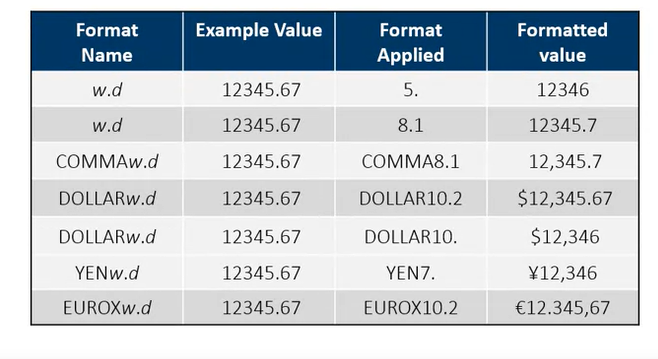

# SAS programming basics

## SAS steps

A SAS script is created by coding several "steps". SAS has 2 types of
steps data steps or procedure steps. You can recognize what a step is
about by looking at the first word of the code snipped. It either starts
with DATA or PROC, but there are are also global statements that can
happen outside of these steps.\
Steps either end with a run statement, most of the time, or a quit
statement (some of the time).

### Data step

Data steps usually read data from an input source, processes it and
creates a SAS table. It might also filter rows, create new columns or
join tables or do other data manipulation.

### Procedure (Proc) step

A proc step processes a SAS table in a specific and predefined way. This
can be outputting a certain graph or doing statistics.

### Global statements

These statements are things like "Title, Options, Libname etc. They
exist outside of the steps, and do not need a run statement after them.

## Simple Syntax error solving steps

When certain key words (such as DATA or var) are typed, SAS
automatically changes their color and sometimes makes them bold. If this
does not happen there is likely to be an error directly before it. If
you run code you should always first check the Log from top to bottom,
if there are errors, these will be noted there. It will tell you what
SAS thought was wrong and how it handled it.

## Column lengths

Oddly enough, the column length will dictate how long the variable can
be. So you have to predefined how many characters can be used. For
example, if the length is 2, "East Coast" will become "EA".

## Missing values

Missing numerical values are represented as a period. They are treated
as the smallest possible number. Missing character values are a
represented as a \*.

## Libraries

When loading data, you can hardcore a file path to your data. Or you can
use a Library to make this quicker and easier to change. You do this by
using `LIBNAME libref enging "path";` This will create a way for SAS to
find your data.

## Working with excel data

When loading data that has column names that wouldn't work for SAS. You
can use `OPTONS VALIDVARNAME=V7;` to make them valid. Things like spaces
or special characters become underscores and every column name is
shortened if needed to be shorter than 32 chars.\
Another important thing is to clear your library reference at the end of
your program. This will otherwise create a lock for other people.
`LIBNAME libref CLEAR;` Using `Sheet=Sheet_name` will allow you to load
anything else than the first excel sheet.

## Importing unstructured data

To import unstructured data, without a wizard, you can use

``` sas
PROC IMPORT DATAFILE="path/filename" DBMS=filetype
  OUT=output-table-name;
RUN;
```

SAS will use the first 20 rows to figure out the column attributes etc.
You can change this by using `GUESSINGROWS=n|MAX;` Either set N to how
much you want it to be or use MAX for all rows.

``` sas
*Complete the PROC IMPORT step;
PROC import datafile="filpath/filename.csv" dbms=CSV
    out=storm_damage_import replace;
Run;
  
*Complte the PROC OCNTENTS step;
PROC contents data=storm_damage_import;
run;
```

## Procudures

Print: creates a listing of all rows and columns of the data.\
Means: simple summary statistics (N Mean Std dev Min Max).\
Univariate: more detailed summary statistics.\
Freq: creates a frequency table for each column in the input table

## WHERE statement

Works like this:

``` sas
Proc procudure-name;
  WHERE expression;
RUN;
```

For dates you follow the "SAS date constant". For example:
*"ddmmmmyyyy"d;*

### Missing values and WHERE statements

IF you do a WHERE statement where you say that a variable needs to be
smaller then x. Make sure to include 0\< before, or all the missing
values will be included. Example: `0<MinPressure<920`

If you are specifically looking for missing values you can use
`where Type=. or Type=" ";` Or you can use the special option of "is
missing", "is NOT MISSING" or "is NULL";\
`WHERE col-name IS MISSING;`\
`WHERE col-name IS NOT MISSING;` `WHERE col-name IS NULL;`\
`WHERE AGE IS MISSING;`\
`WHERE col-name IS null;`

### Wildcards for WHERE statements

\% is a wildcard for any number of characters.\
\_ is a wildcard for a single character

for example:\
`Where city like "New%"; Give new york new delly etc.`Where city like
"sant\_ %"\`\
Gives you for example Santa Clara or Santo Domingo

## combining statment

You can combine multiple statements using `and` or `or`.
`WHERE Type="SUV" or Type="truck" or Type="wagon;`

However, it's better to use `in`;\
`Where col-name IN (value1<...,value-n>);`\
`Where col-name NOT IN (value1<...,value-n>);`\
`Where Type IN ("SUV", "Truck", "Wagon");`

## Macro variables

Macro variable are variables you can create that allow you to group
names, so you only have to change it in one place. For example if you
want to change the `Type="Wagon"` to `Type="SUV"`:

``` sas
proc print data=sashelp.cars;
  where Type="Wagon";
  var Type make Model MSRP;
Run;
proc means data=sashelp.cars;
  where Type="Wagon";
  var MSRP MPG_Highway;
Run;
proc freq data=sashelp.cars;
  where Type="Wagon";
  tables Origin Make;
Run;
```

You would have to change 3 things. If you instead start with
`%let VaribleName=Columnname` you would only have to change the
Columname (Wagon) to SUV.

``` sas
%let CarType=Wagon;
proc print data=sashelp.cars;
  where Type="&CarType";
  var Type make Model MSRP;
Run;
proc means data=sashelp.cars;
  where Type="&CarType";
  var MSRP MPG_Highway;
Run;
proc freq data=sashelp.cars;
  where Type="&CarType";
  tables Origin Make;
Run;
```

There are no quotation marks. However, if you reference the macro
variable you need to put quotation marks if you would have normally and
they always need to be double quotation marks.

## Formating your output

In the case of Money or dates it might be usefull or nececery to look at
a formatted output because raw data does not make sense. In this case
you can use the `FORMAT col-name(s) format;` function. The format needs
the following input:\
\<\$\>format-name<w>.<d> where \$= a characther\
w= the width .=required delimiter\
d=number of decimal places\
For example: `format height weight 3.` which should give you 3 numbers
for both of them.



## Sorting values 
For this you can use the `by` function. It will sort the data ascendinly based on the variable that follows `by`.  

## Deleting duplicates
For this you can use the `NoDUPKEY<DUPOUT=output-table>;`
If you add the `DUPOUT=output-table` you will end up also with a table with all the duplicates.  
If you add `By_all_;` It will only delete duplicates where all columns are the same. If it depends on sepecific columns you instead say `by col-name(s);`
